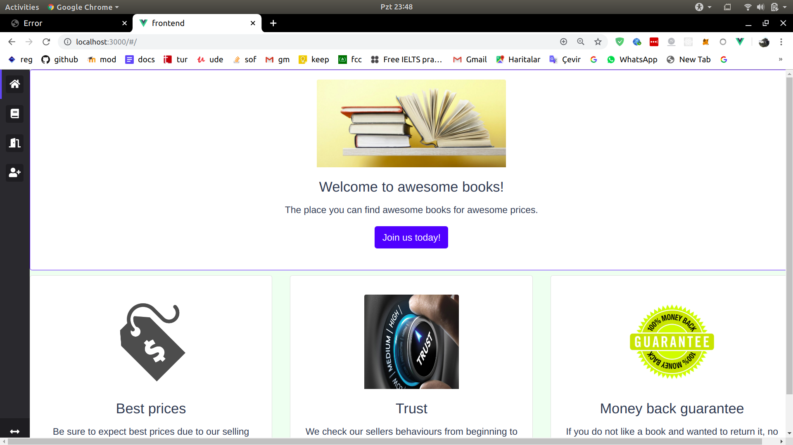
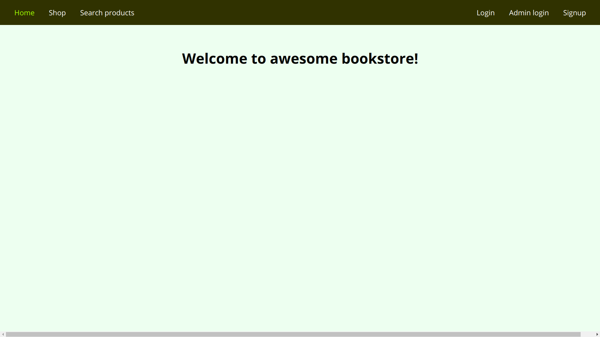
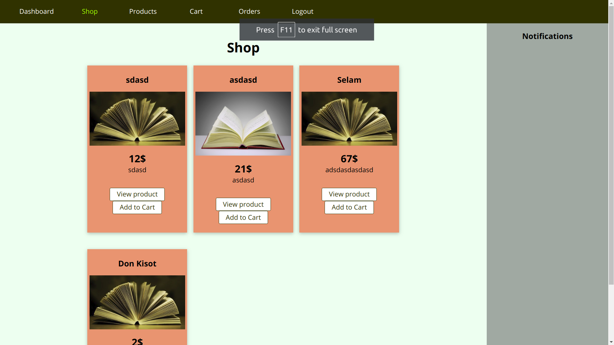
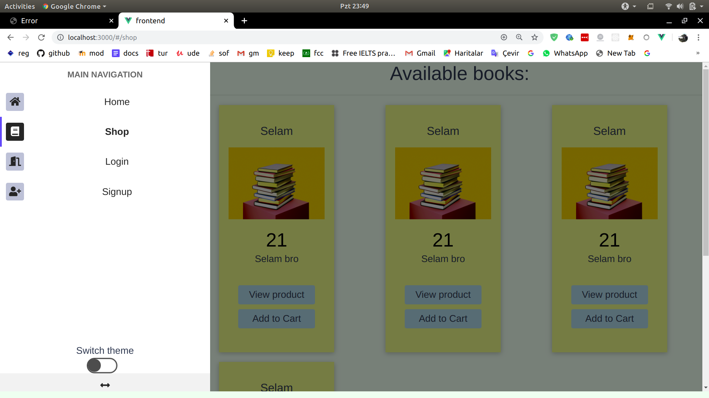
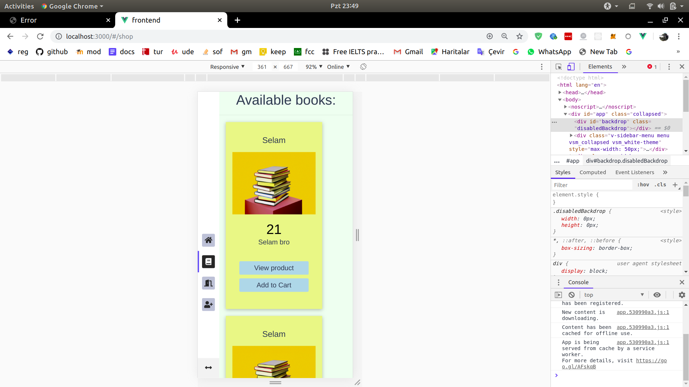
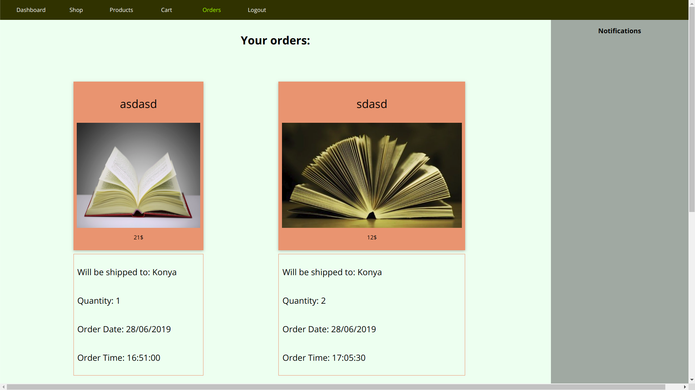
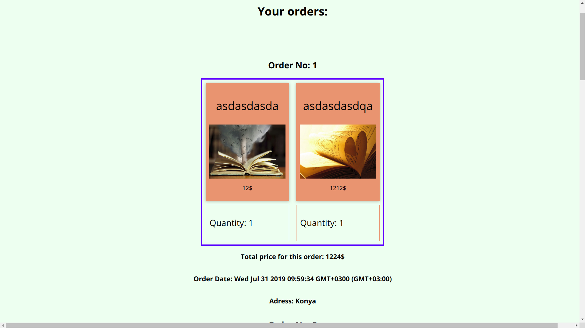
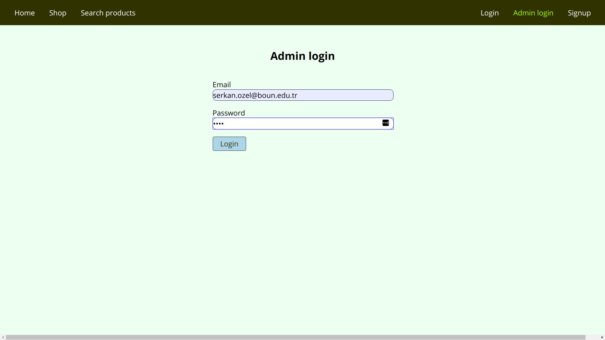
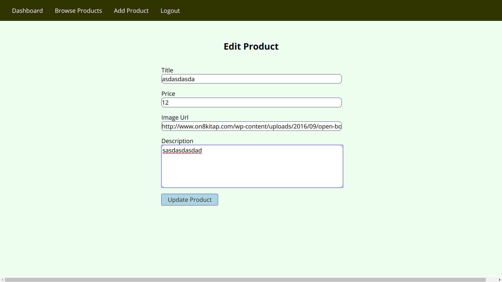

# LearnNode
Learning Node.js on Udemy with Maximillian Schwarzmüller

* This project is for learning backend development.
* There will be SQL and NoSQL databases used.
* Used or to be used database frameworks: plain mysql2, sequelize, mongodb(started it now)
* This site is mobile friendly and has a different navigation menu for mobile.
* This is a book store site, in which there are admins that can add new products.
* There are users who can:
    * Add products to cart
    * View product details
    * Checkout and order some products
    * View their products
    * Add one more, delete one, delete all from cart
# Commit Guide

* Starting from this commit which almost 100th one, I will categorize my commits into one of the following categories and I will commit only one thing at a time, thus making them more readable:
    * Bug: Does my commit fix a bug?
    * Feature: Does my commit add a new feature?
    * Typo: Does my commit correct a wrongly written text?
    * Style: Does my commit is related to user interface(css & html together)?
    * Controller: Does my commit change my controller logic?
    * Model: Does my commit change my model logic?
    * Package: Does my commit include only package-lock and package json files?
    * Config: Does my code change something config file?
    * Gitignore: Does my code change .gitignore?
    * Asset: Does my commit add some media file?
    * Script: Does my code adds client side javascript?
    * Assignment: Does my code add an assignment?
    * Restructure: Does my code move files or folders?
    * Readme: Does my code changes readme?
    * Routes: Does my code changes routes?
    
# Images:

